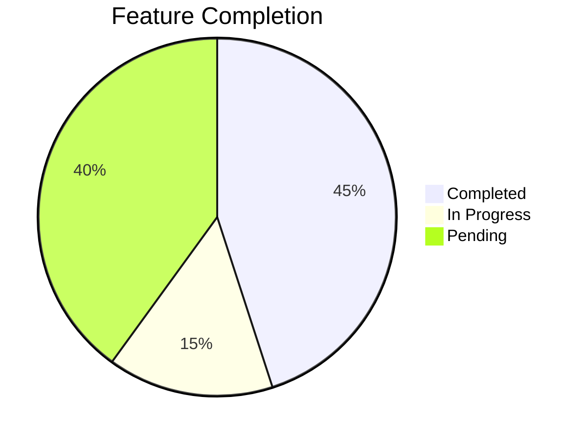
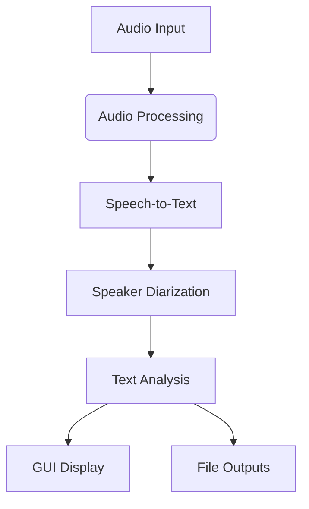
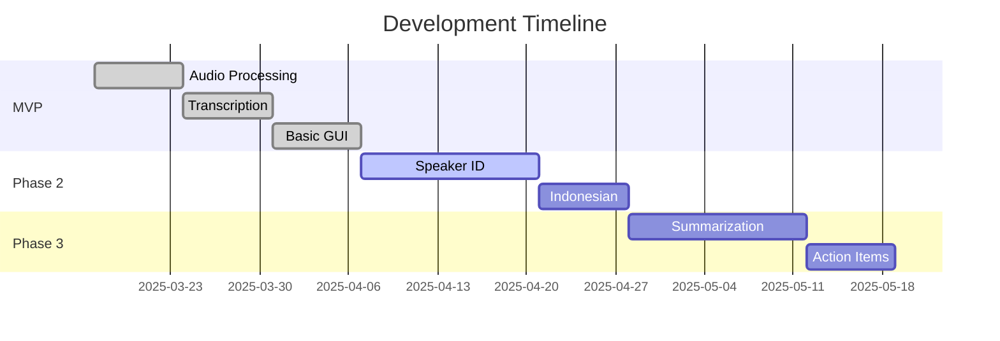

# Meeting Transcriber Project


## Current Implementation Status



### ✅ Implemented Features
- Audio processing (WAV/MP3/M4A support)
- Whisper.cpp English transcription
- Basic PySimpleGUI interface
- File selection and processing workflow

### 🚧 In Development
- Speaker diarization (Pyannote-audio integration)
- Indonesian language support

### 📅 Planned Features
- AI summarization (Ollama integration)
- Action item extraction
- Enhanced output formats

## System Architecture



## Getting Started

1. Install requirements:
```bash
pip install -r meeting_transcriber/requirements.txt
```

2. Run the application:
```bash
python meeting_transcriber/main.py
```

## Development Roadmap



## Contributing
Pull requests welcome. Please follow the existing code style and add tests for new features.