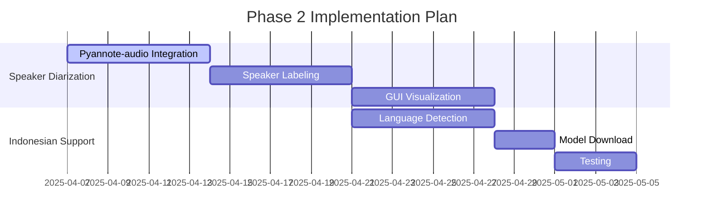

# Meeting Transcriber Implementation Plan

## Current Status (MVP Complete)
- ✅ Project structure setup
- ✅ Audio processing (WAV/MP3/M4A support)
- ✅ Whisper.cpp English transcription integration  
- ✅ Basic PySimpleGUI interface
- ✅ File selection and processing workflow

## Pending Features by Phase

### Phase 2: Speaker Diarization & Indonesian Support

### Phase 3: AI Summarization
- Ollama local LLM setup
- Key point extraction
- Decision tracking
- Summary view in GUI

### Phase 4: Action Items
- Task pattern matching ("we should", "need to")
- Responsible party assignment
- Multiple output formats (TXT, MD, CSV)

## Technical Requirements
1. **Speaker Diarization**:
   - Install Pyannote-audio: `pip install pyannote.audio`
   - Minimum 85% speaker separation accuracy
   - Speaker labeling in transcripts

2. **Indonesian Support**:
   - Download ggml-base.id.bin model
   - Add language selector to GUI

3. **Ollama Integration**:
   - Local Ollama server setup
   - Prompt engineering for meeting summaries

## Risk Assessment
| Risk | Mitigation |
|------|------------|
| Pyannote performance | Test with sample meetings |
| Model size constraints | Use quantized models |
| Ollama resource usage | Implement caching |

## Next Steps
1. Implement speaker diarization module
2. Add language selection to GUI
3. Integrate Ollama for summarization