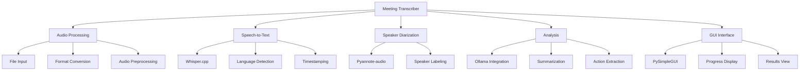

# Meeting Transcriber Implementation Plan

## System Architecture

## Development Phases

### 1. MVP (Weeks 1-4)
- [ ] Setup project structure and dependencies
- [ ] Implement audio processing module
- [ ] Integrate Whisper.cpp for English transcription
- [ ] Develop basic GUI interface

### 2. Phase 2 (Weeks 5-6)
- [ ] Add speaker diarization with Pyannote-audio
- [ ] Implement Indonesian language support
- [ ] Enhance GUI with speaker visualization

### 3. Phase 3 (Weeks 7-8)
- [ ] Integrate Ollama for summarization
- [ ] Develop context-aware analysis
- [ ] Add summary output format

### 4. Phase 4 (Week 9)
- [ ] Implement action item extraction
- [ ] Add multiple output formats (txt, md, csv)
- [ ] Final testing and optimization

## Technical Specifications
- Python 3.10+
- Whisper.cpp (ggml-base.en.bin model) for speech-to-text:
  - English language only
  - ~1GB model size
  - Base model quality (WER ~5-10%)
  - Optimized for CPU inference
- Pyannote-audio for speaker diarization
- Ollama for summarization
- Librosa for audio processing
- PySimpleGUI for interface